## Used:

1. productFlavors - for Android
1. additional scheme - iOS
1. react-native-config - for setting up config via ENV

## Links:

- [iOS - setting up additional scheme](http://onebigfunction.com/ios/2017/03/14/flavor-ios/)
- [Android - setting up productFlavors](http://onebigfunction.com/android/2016/10/06/flavor-flav-android-product-flavors-explained/)
- [react-native-config](https://github.com/luggit/react-native-config)

#### WARNING!

- **Please - use only "dev" scheme/productFlavor for development! "stage"/"production" are going to be used while QA/Production**
- **On iOS platform only "dev" scheme is debuggable, "stage"/"production" are signed via release configs**

## How to use:

### Android:

#### WARNING!

- No pure `react-native run-android` usage. For development - please use commands below;
- No pure `cd android && ./gradlew assembleRelease` usage. For development - please use commands below;

#### Running on simulator/real device in debug mode:

1. `react-native run-android --variant=devDebug` - dev version (uses config from .env.dev);
1. `react-native run-android --variant=stageDebug` - stage version (uses config from .env.stage);
1. `react-native run-android --variant=productionDebug` - production version (uses config from .env.production);

##### NOTE: After build was successfully assembled - it can show next error:

`Starting: Intent { cmp=com.app/.MainActivity }
Error type 3
Error: Activity class {com.app/com.app.MainActivity} does not exist.`

##### That is ok. Just press on application icon on your simulator/device and everything will work;

#### Assembling build (release mode):

1. `cd android && ./gradlew assembleDev` - dev version (uses config from .env.dev);
1. `cd android && ./gradlew assembleStage` - stage version (uses config from .env.stage);
1. `cd android && ./gradlew assembleProduction` - production version (uses config from .env.production);

### iOS:

#### WARNING!

- No pure `react-native run-ios` usage. For development - please use Xcode;

#### Running on simulator/real device:

1. Choose scheme here:
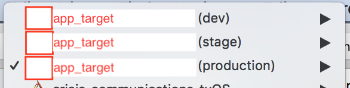
1. Run on simulator/device;

#### Assembling build (release mode):

1. Choose scheme here:

1. Run "Product/Archive";

## What has changed:

### Android:

- `react-native-config` - basic link changes (MainApplication.java, settings.gradle, android/app/build.gradle);
- `android/app/build.gradle` - all changes are marked;
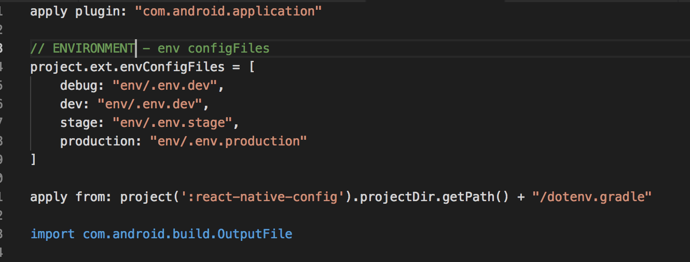
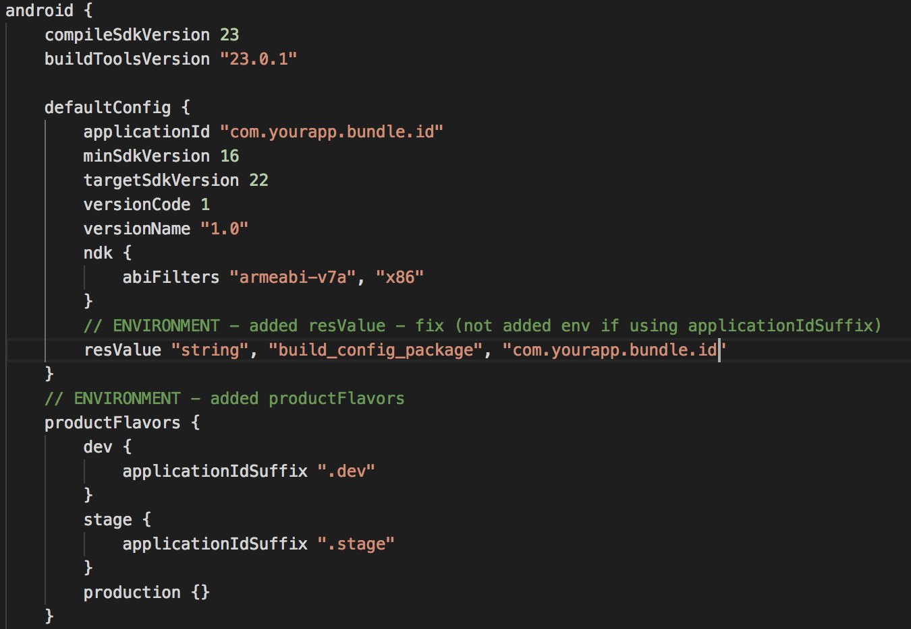
- `proguard-rules.pro` - all changes are marked;
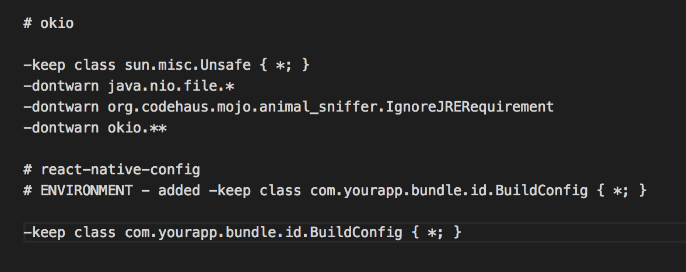
- added `app/src/dev/res/values/strings.xml` for "dev" productFlavor - for bundle name `DEV-app`;
- added `app/src/stage/res/values/strings.xml` for "stage" productFlavor - for bundle name `STAGING-app`;
- added `app/src/production/res/values/strings.xml` for "production" productFlavor - for bundle name `app`;

### iOS:

- `react-native-config` - basic link changes (Libraries, Build Setting, Linked Frameworks and Libraries, Build Phases);

- Added new configuration (Staging)

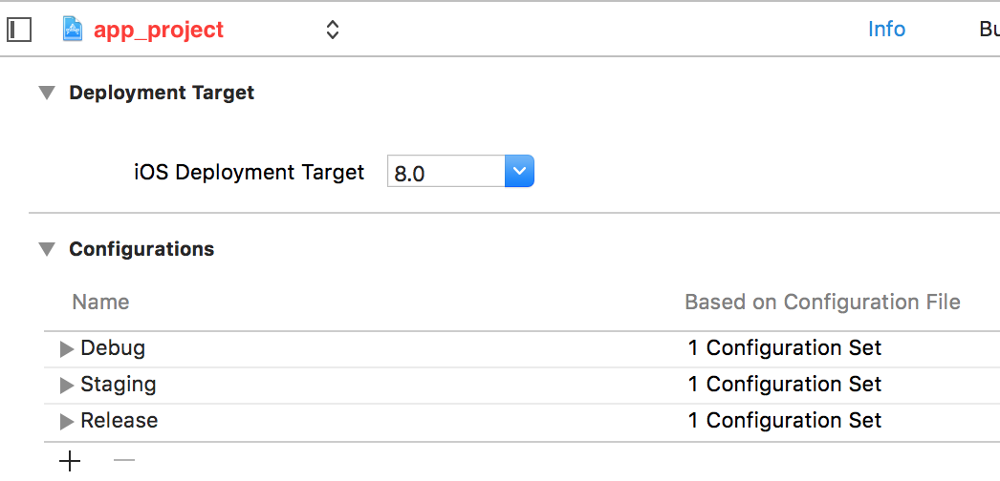

- Added new User-Defined Settings (APP_BUNDLE_ID_SUFFIX, APP_ENVIRONMENT, APP_PRODUCT_NAME)

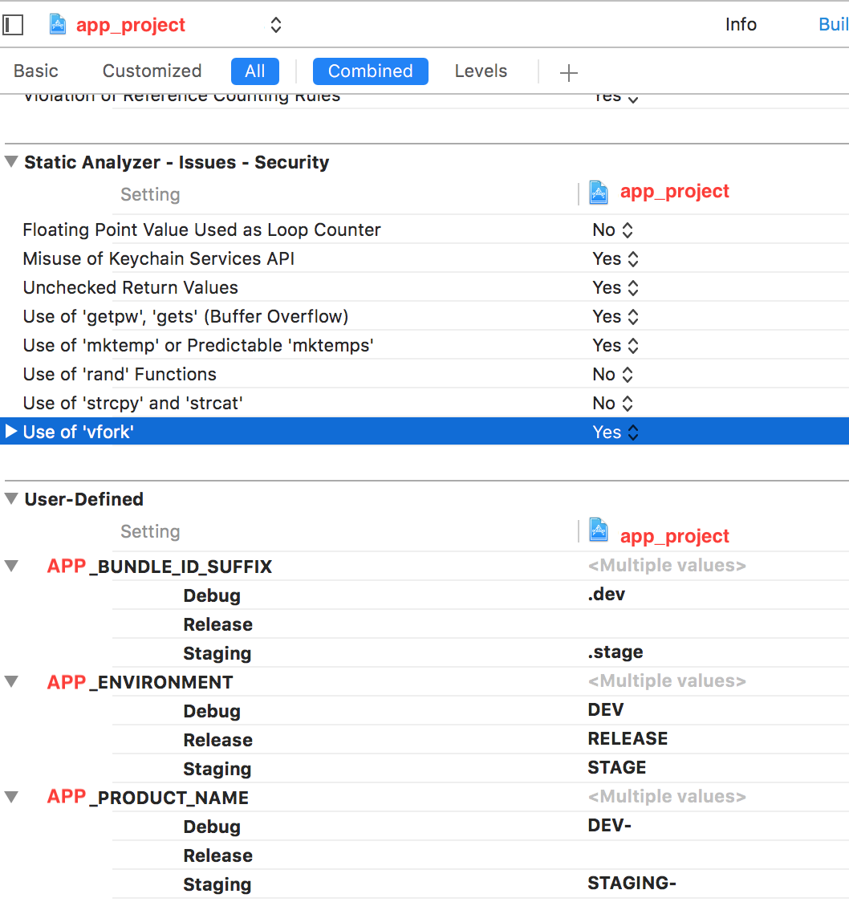

- Updated Product Bundle Identifier for each configuration (Debug, Staging, Release)

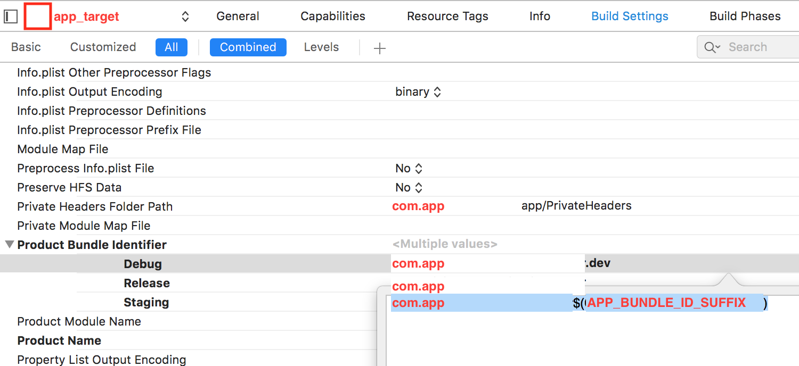

- Added Library Search Paths fix for new configuration (Staging)

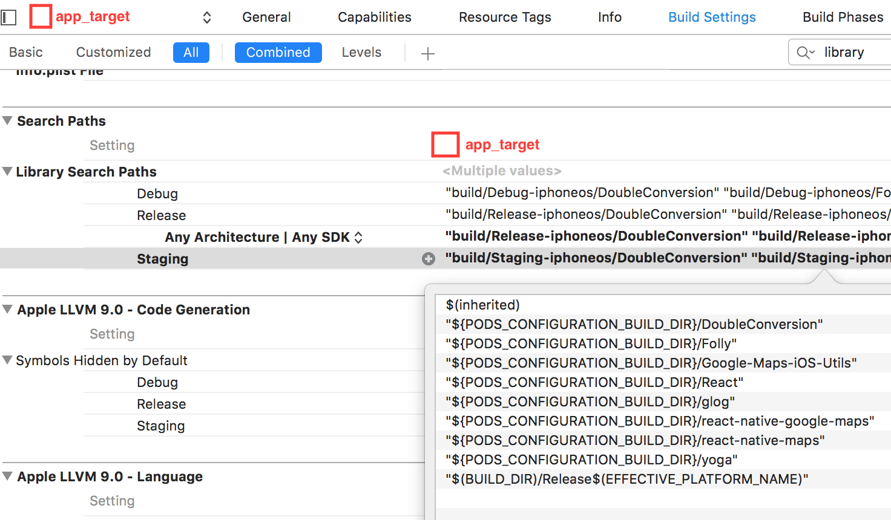

- Added Per-configuration build products path fix for new configuration (for "App Target" on tab "Build Settings") (Staging) 

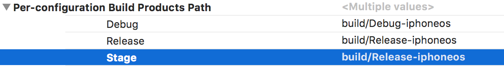

- Updated Product Name (Added Prefix)

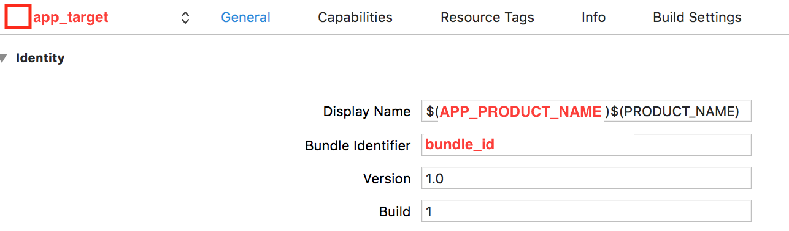

- Duplicated "production" scheme - called "stage" scheme

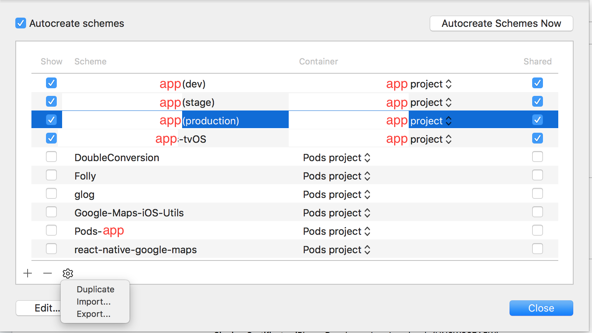

- Edited ALL schemes ("dev", "stage", "production"); For each scheme - setting up `Pre-actions`

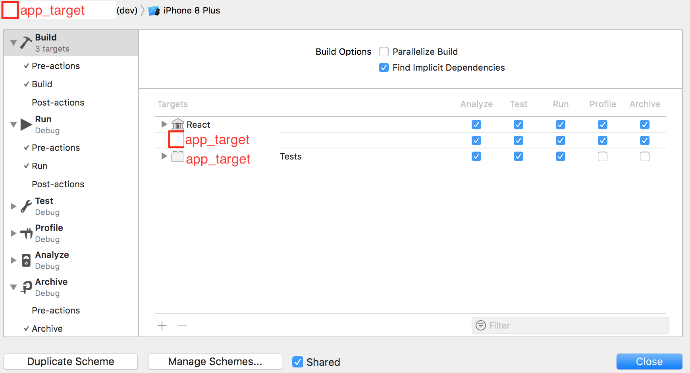

- Set up Pre-action script for ALL schemes (Build, Run, Archive):

1. "dev" - ".env.dev"
1. "stage" - ".env.stage"
1. "production" - ".env.production"

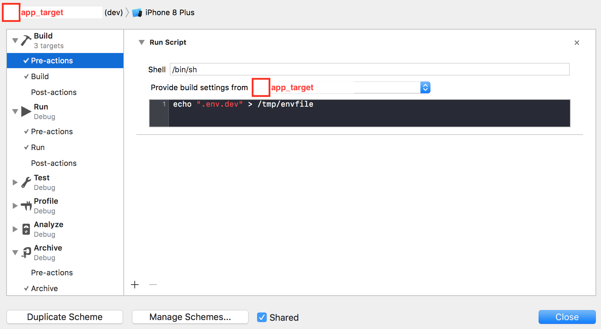

- Set up Build Configuration script for ALL schemes (Run, Archive):

1. "dev" - "Debug"
1. "stage" - "Staging"
1. "production" - "Release"

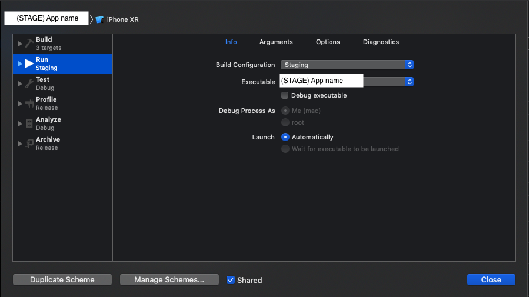
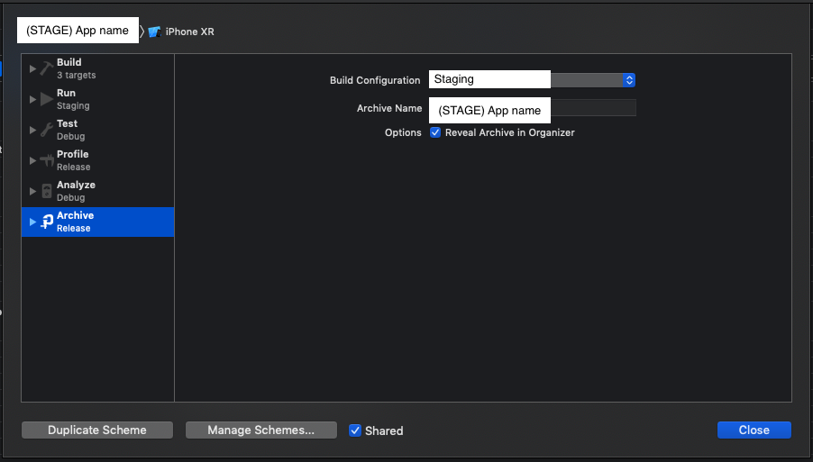
